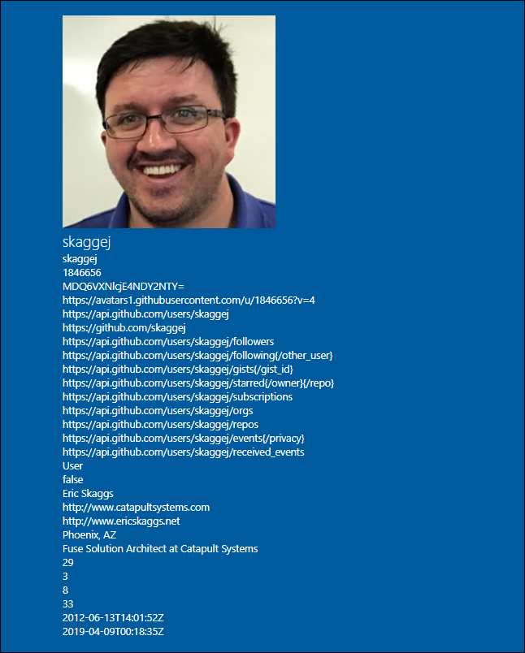

# GitHub Badge (JavaScript version)

## Summary
Displays information from GitHub for a specified user.

## Used SharePoint Framework Version 

## Applies to

* [SharePoint Framework](https://docs.microsoft.com/sharepoint/dev/spfx/sharepoint-framework-overview)
* [Office 365 tenant](https://docs.microsoft.com/sharepoint/dev/spfx/set-up-your-development-environment)

## Prerequisites
 
None

## Solution

Solution|Author(s)
--------|---------
js-GitHubBadge | Eric Skaggs [@skaggej](https://www.twitter.com/skaggej)

## Version history

Version|Date|Comments
-------|----|--------
1.0 | April 18, 2019 | Initial release

## Disclaimer
**THIS CODE IS PROVIDED *AS IS* WITHOUT WARRANTY OF ANY KIND, EITHER EXPRESS OR IMPLIED, INCLUDING ANY IMPLIED WARRANTIES OF FITNESS FOR A PARTICULAR PURPOSE, MERCHANTABILITY, OR NON-INFRINGEMENT.**

---

## Minimal Path to Awesome

- Clone this repository
- in the command line run:
  - `npm install`
  - `gulp serve`

> Include any additional steps as needed.

## Features
It's not the prettiest thing in the world, but the goal here was to create a web part that demonstrates something a bit beyond the standard "Hello, World!" web part in which we change some HTML. This sample shows how to pull in data from somewhere without authentication and without over-complicating things.

Future samples will refactor this into something more professional that follows recommended coding patterns and practices and leverage modern frameworks.

Ultimately, this sample along with its yet-to-be-created future samples could be a useful teaching tool to developers new to SPFx as well as developers who aren't well-versed in SPFx coding patterns or the various frameworks available.

