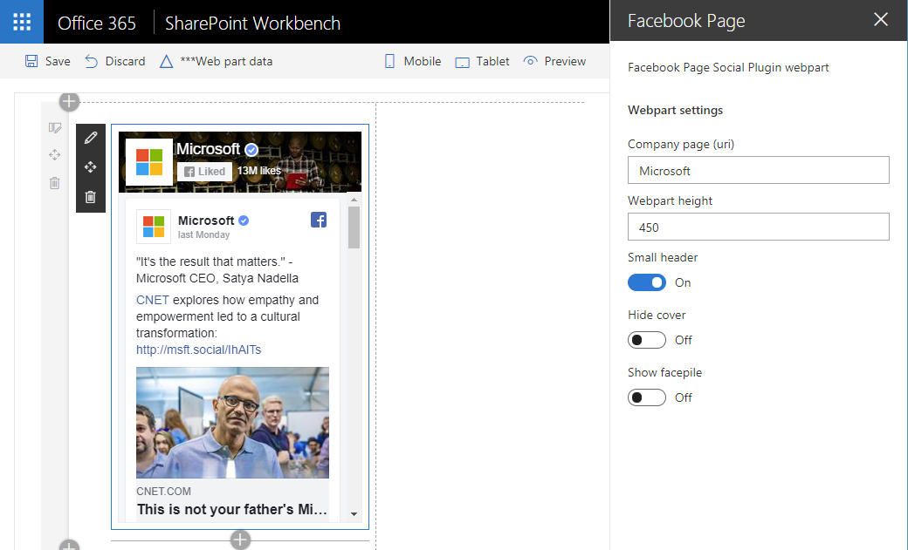

# Facebook Page Social Plugin

## Summary

This sample shows how to implement iFrame-based web parts with a dynamic responsive behavior on the example of Facebook Page Social Plugin.

The key differences between using Embed web part and current example are the strong parametrization of web part properties and responsive behavior of the iFrame depending on parent container width changes.

## Used SharePoint Framework Version

## Applies to

* [SharePoint Framework](https://docs.microsoft.com/sharepoint/dev/spfx/sharepoint-framework-overview)
* [Office 365 tenant](https://docs.microsoft.com/sharepoint/dev/spfx/set-up-your-development-environment)

## Solution

Solution | Author(s)
---------|----------
react-facebook-plugin | Andrew Koltyakov ([@AndrewKoltyakov](https://twitter.com/AndrewKoltyakov))

## Version history

Version | Date| Comments
--------|-----|---------
1.0 | August 26, 2018 | Initial release

## Disclaimer

**THIS CODE IS PROVIDED *AS IS* WITHOUT WARRANTY OF ANY KIND, EITHER EXPRESS OR IMPLIED, INCLUDING ANY IMPLIED WARRANTIES OF FITNESS FOR A PARTICULAR PURPOSE, MERCHANTABILITY, OR NON-INFRINGEMENT.**

---

## Minimal Path to Awesome

### Local testing

* Clone the repository
* `cd` to web part's project folder
* In the command line run:
  * `npm install`
  * `gulp serve`

### Deployment

Follow the usual SPFx deployment process up to your preferences.

## Features

This web part illustrates the following concepts on top of the SharePoint Framework:

* Observe parent container width and dynamic adaptation of absolute-width'ed HTML elements
* React

