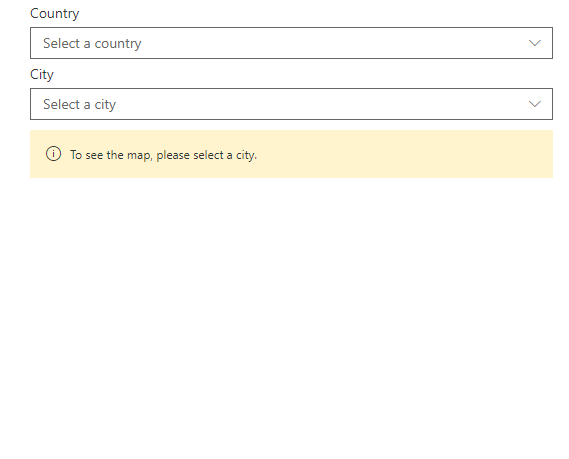
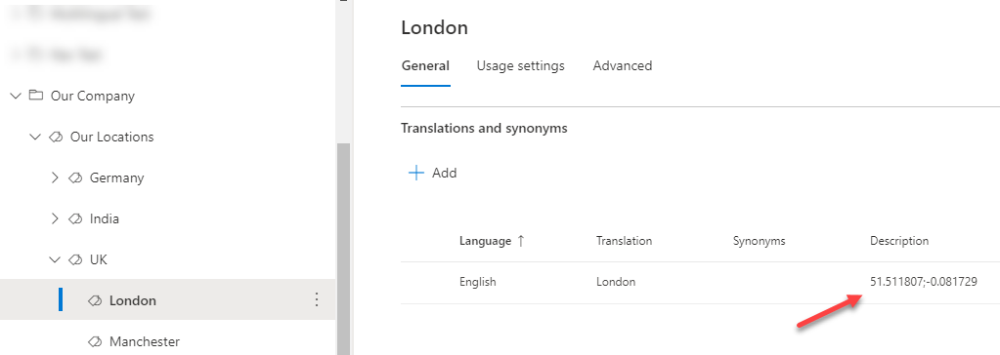

# Cascading managed metadata using Graph API (beta)

## Summary

This web part shows how to use the Microsoft Graph APIs (beta) for Taxonomy to get the data.

### Functionality

### Termstore

## Used SharePoint Framework Version

## Applies to

* [SharePoint Framework Developer](https://docs.microsoft.com/sharepoint/dev/spfx/sharepoint-framework-overview)
* [Office 365 developer tenant](https://docs.microsoft.com/sharepoint/dev/spfx/set-up-your-developer-tenant)

## Pre-requisites

* Set up the termset structure as shown in the image above.
* For the cities, get the required latitude and longitude.
* Set the description of the city term as `latitude;longitude` (as highlighted for the term `London` in the image above).

## Solution

Solution|Author(s)
--------|---------
react-graph-cascading-managed-metadata| Anoop Tatti ([anoopt](https://github.com/anoopt), [@anooptells](https://twitter.com/anooptells))

## Version history

Version|Date|Comments
-------|----|--------
1.0.0|Aug 24, 2020|Initial release
1.0.1|Sep 03, 2020|Error handling and logging improvements

## Disclaimer

**THIS CODE IS PROVIDED *AS IS* WITHOUT WARRANTY OF ANY KIND, EITHER EXPRESS OR IMPLIED, INCLUDING ANY IMPLIED WARRANTIES OF FITNESS FOR A PARTICULAR PURPOSE, MERCHANTABILITY, OR NON-INFRINGEMENT.**

---

## Minimal Path to Awesome

* Clone this repository
* in the command line run:
  * `npm install`
  * `gulp serve`

## Features

This sample illustrates the following concepts on top of the SharePoint Framework:

* Get data terms using Microsoft Graph API (beta).
* React Hooks
* Using async / await for the async calls
* Caching the data in session storage
* Usage of PnP SPFx controls (Maps and Placeholder)
* Office UI fabric components

### Enhancements

* Currently, this web part supports 2-level cascading. So there is scope to enhance this such that it supports more levels of cascading dynamically.
* Currently, this web part reads latitude and longitude from description of the city terms. If there is a way of getting these from the custom properties of the city terms, then that needs to be implemented.

