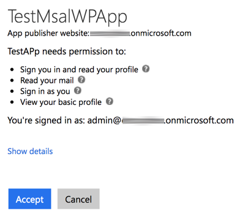
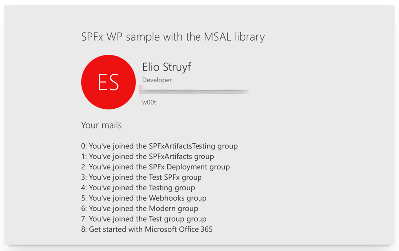
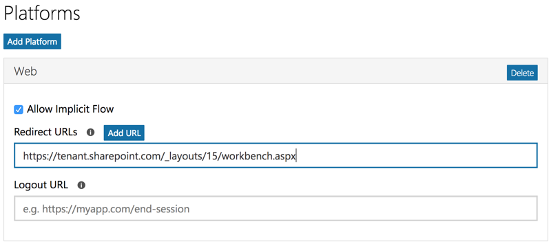

# Microsoft Authentication Library (MSAL JS) authentication sample

## Summary

Sample SharePoint Framework web part which makes use of the [Microsoft Authentication Library (MSAL JS)](https://github.com/AzureAD/microsoft-authentication-library-for-js) to call the Microsoft Graph.

### MSAL WP

The sample web part will retrieve an access token with the `User.Read` and `Mail.Read` scope. Once an access token is retrieved, it will do a call to receive the current user and its mail messages.

After you gave permissions, the following will information will get displayed:

## Used SharePoint Framework Version 

## Applies to

* [SharePoint Framework](https://docs.microsoft.com/sharepoint/dev/spfx/sharepoint-framework-overview)
* [Office 365 developer tenant](https://docs.microsoft.com/sharepoint/dev/spfx/set-up-your-developer-tenant)

## Solution

Solution|Author(s)
--------|---------
react-msal-msgraph|Elio Struyf (MVP, [U2U](https://www.u2u.be), [@eliostruyf](https://www.twitter.com/eliostruyf))

## Version history

Version|Date|Comments
-------|----|--------
1.0.0|March 17, 2017|Initial release

## Disclaimer
**THIS CODE IS PROVIDED *AS IS* WITHOUT WARRANTY OF ANY KIND, EITHER EXPRESS OR IMPLIED, INCLUDING ANY IMPLIED WARRANTIES OF FITNESS FOR A PARTICULAR PURPOSE, MERCHANTABILITY, OR NON-INFRINGEMENT.**

---

## Prerequisites

- Office 365 subscription with SharePoint Online and Exchange

## Minimal Path to Awesome

- Clone this repo
- Go and register a new application on [https://apps.dev.microsoft.com](https://apps.dev.microsoft.com)
    - Once logged in, click on **add an app**
    - Specify the application name, and click create
    - Click on **add platform**, and choose **web**
    - Specify the workbench URL and be sure that **allow implicit flow** is enabled
    - Click on save to store these changes

- Copy the **application id** and change add this to the [MsalWP.tsx file on line 20](./src/webparts/msalWp/components/MsalWp.tsx#20)
- Run `npm i`
- Run `gulp serve --nobrowser`
- Test out your web part in the local or hosted workbench

## Features

Sample web part in this solution illustrates the following concepts on top of the SharePoint Framework:

- using React for building SharePoint Framework client-side web parts
- using Office UI Fabric React styles for building user experience consistent with SharePoint and Office
- on-demand authentication with the Azure Active Directory using the MSAL JS library
- communicating with the Microsoft Graph using its REST API
- using the MSAL JS library with SharePoint Framework web parts built using React

