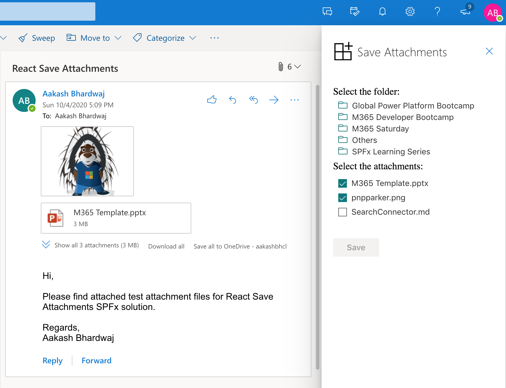

# Save Outlook Attachments

## Summary

This SPFx Outlook Add-In lets users save any email attachments to a OneDrive folder. The users can select any OneDrive folder/subfolder and choose the attachments that need to be saved. It uses Microsoft Graph API to fetch the OneDrive folders and upload the attachment files.

## Used SharePoint Framework Version

## Features

This web part illustrates the below features for creating Outlook Add-Ins using SPFx.

* Select Office context and attributes of currently selected mail
* Requesting **Mail.Read** and **Files.ReadWrite** permission scopes for Microsoft Graph through the `webApiPermissionRequests` property in `package-solution.json`
* Use Microsoft Graph to retrieve folders and sub-folders for OneDrive
* Use Microsoft Graph to retrieve complete mail `mimestream` by given `ID`
* Use Microsoft Graph to save normal or big files (in size bigger 4MB) with different concepts

## Solution

Solution|Author(s)
--------|---------
react-save-attachments | [Aakash Bhardwaj](https://twitter.com/aakash_316)

## Version history

Version|Date|Comments
-------|----|--------
1.0|October 4, 2020|Initial release

## Minimal Path to Awesome

* Clone this repository
* In the command line run:
  * Restore dependencies: `npm install`
  From here you can also follow the deployment steps from the official [Microsoft Tutorial](https://docs.microsoft.com/en-us/sharepoint/dev/spfx/web-parts/get-started/office-addins-tutorial#packaging-and-deploying-your-solution-to-sharepoint)
  * Build solution `gulp build --ship`
  * Bundle solution: `gulp bundle --ship`
  * Package solution: `gulp package-solution --ship`
  * Locate solution at `.\sharepoint\solution\react-save-attachments.sppkg`
  * Upload it to your tenant app catalog
  * Go to your Outlook Web Access then double-click an e-mail to open it in a window
  * Choose **...** and **Get Add-ins**
  * Choose **My Add-ins** from left menu
  * Under **Custom add-ins**, choose **+ Add a custom add-in**, then **Add from file...**
  * Upload the manifest xml file from `\officeAddin` folder
  * Click **Install** on the warning message to get your add-in available on the tenant
* Go to the **API Management** section in the new SharePoint Admin Center (*https://{tenantname}-admin.sharepoint.com/_layouts/15/online/AdminHome.aspx#/webApiPermissionManagement*)
* **Approve** the permission request for **Mail.ReadWrite** and **Files.ReadWrite** to **Microsoft Graph**

## Disclaimer

**THIS CODE IS PROVIDED *AS IS* WITHOUT WARRANTY OF ANY KIND, EITHER EXPRESS OR IMPLIED, INCLUDING ANY IMPLIED WARRANTIES OF FITNESS FOR A PARTICULAR PURPOSE, MERCHANTABILITY, OR NON-INFRINGEMENT.**

---

