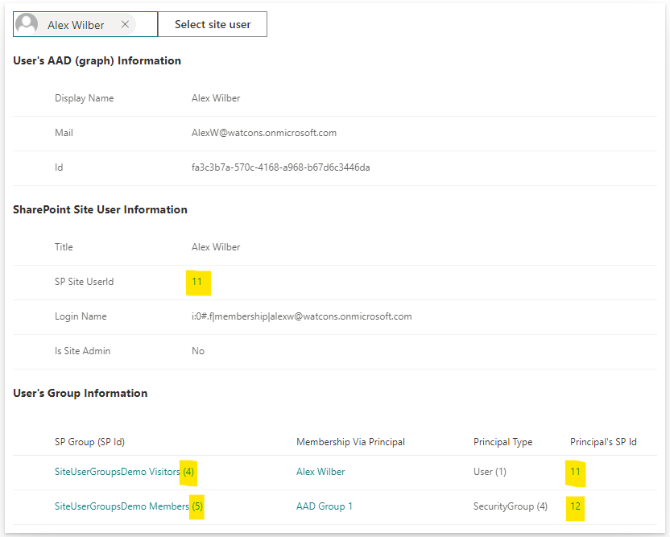
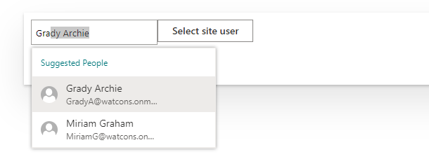
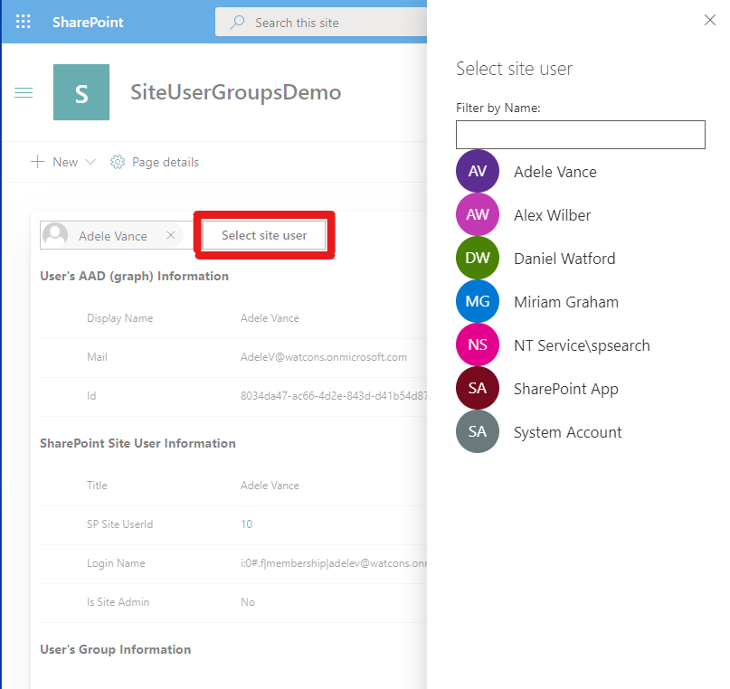

# Site User and Group Information

## Summary

Looks up the SharePoint site user/group ids related to a user. Azure AD groups that the user belongs to, and which are known to the SharePoint site, are also displayed.

Note: Azure AD Groups are represented as Site Users in SharePoint.

## Used SharePoint Framework Version

## Applies to

- [SharePoint Framework](https://aka.ms/spfx)
- [Microsoft 365 tenant](https://docs.microsoft.com/en-us/sharepoint/dev/spfx/set-up-your-developer-tenant)

> Get your own free development tenant by subscribing to [Microsoft 365 developer program](http://aka.ms/o365devprogram)

## Prerequisites

Access to a SharePoint online site with various tenant users granted access to various site resources directly, via AAD groups and via SharePoint groups.

## Solution

| Solution                  | Author(s)                                                                                               |
| ------------------------- | ------------------------------------------------------------------------------------------------------- |
| react-sp-site-user-groups | Daniel Watford (https://twitter.com/DanWatford), Watford Consulting Ltd (https://watfordconsulting.com) |

## Version history

| Version | Date              | Comments        |
| ------- | ----------------- | --------------- |
| 0.0.1   | September 8, 2020 | Initial release |

## Disclaimer

**THIS CODE IS PROVIDED _AS IS_ WITHOUT WARRANTY OF ANY KIND, EITHER EXPRESS OR IMPLIED, INCLUDING ANY IMPLIED WARRANTIES OF FITNESS FOR A PARTICULAR PURPOSE, MERCHANTABILITY, OR NON-INFRINGEMENT.**

---

## Minimal Path to Awesome

- Clone this repository
- Ensure that you are at the solution folder
- in the command-line run:
  - **npm install**
  - **gulp trust-dev-cert**
  - **gulp serve --nobrowser**
- Open the hosted workbench on a SharePoint site - i.e. https://_tenant_.sharepoint.com/site/_sitename_/_layouts/workbench.aspx
- Add the User and Group Info web part to the page.
- View the current user's information and the 'user' information for any Azure AD groups the user belongs to which are also known to the SharePoint site.

## Features

This web part was created to better understand the relationship between AAD users, AAD groups, SP User and SP Groups. In particular I was interested in how SP site user/group ids are mapped to the 4 principal types so that I might match a user against values entered in a SP People column which also accepted group values.

Experiment by granting permissions directly to some users for a site, directly to an AAD group for a site, and to a SP group where the membership consists of the AAD user or nested AAD groups.

Pick a user to retrieve information for by either searching for the user in the tenant-wide People Picker, or by choosing from the site's current set of users.

For the principals found that relate to a user links are provided to the relevant site user/group view.

## Display user's membership of AAD and SP groups

When the web part is first loaded the current user is selected.

Details of the user's membership of SP and AAD groups are shown, along with corresponding SP site user/group ids (highlighted).

## Select User

The user can be selected from the tenant-wide People Picker control.
Click the X to clear the currently selected user and then start typing the name of the next user. The People Picker will search across all tenant users as you type.

You can also select a user from the current set of site users.
Click on the /Select site user/ button and choose a user from the list displayed on the panel.

## Related Solutions

See sample solution [react-check-user-group](../react-check-user-group) by [aakashbhardwaj619](https://github.com/aakashbhardwaj619) for a method of looking up a user's AAD groups and the membership list of an AAD group. This solution differs by looking at the mappings between an AAD group and a SharePoint site user.

## References

- [User profile synchronization](https://docs.microsoft.com/en-us/sharepoint/user-profile-sync)

---

